<h1 align="center">🎬 Rokhshare</h1>

Rokhshare is an online movie streaming service that allows us to share and streams movies.

---

## 📖 Introduction
**Rokhshare** is the complete backend for a movie and series streaming platform, developed with Django and Django REST Framework.  
It provides:

- A **fully functional RESTful API** for all features (movies, series, users, ads, subscription, etc.)
- Modular structure with reusable Django apps
- Secure user authentication and media access management

This repository contains the entire **backend** logic of the Rokhshare platform. The panel admin and mobile applications are hosted in separate repositories.

## 🧩 Related Repositories

- 🌐 **Panel Admin** (Flutter): [Panel Admin Repository Link](https://github.com/Mohammadfazel03/rokhshare-dashboard)
- 📱 **Mobile App** (Flutter): [Mobile Repository Link](https://github.com/Mohammadfazel03/rokhshare-app)

## 🚀 Features

- Categorization and tagging
- Advanced search and filtering
- User authentication (Login/Register)
- RESTful API for frontend integration
- Generate passive income for stakeholders through subscription sales.
- Ability to add ads to generate revenue for the platform.
- Ability to comment and rate for better suggestions and selection of arts.

## 🛠 Tech Stack

- Python 3.x
- Django 4.
- Django REST Framework
- PostgreSQL (or SQLite for development)
- JWT or session-based authentication

## 🔍 Explore the App

    
    
    
    
    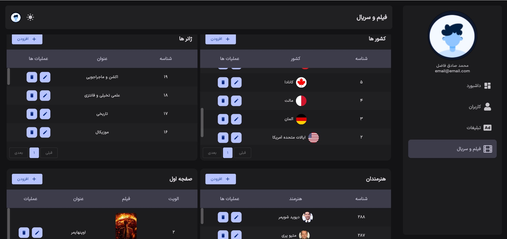
    
    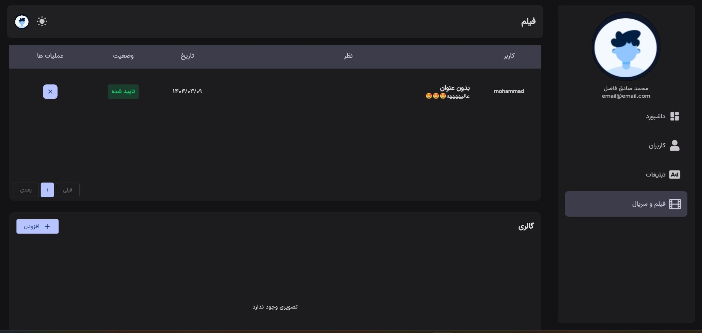
    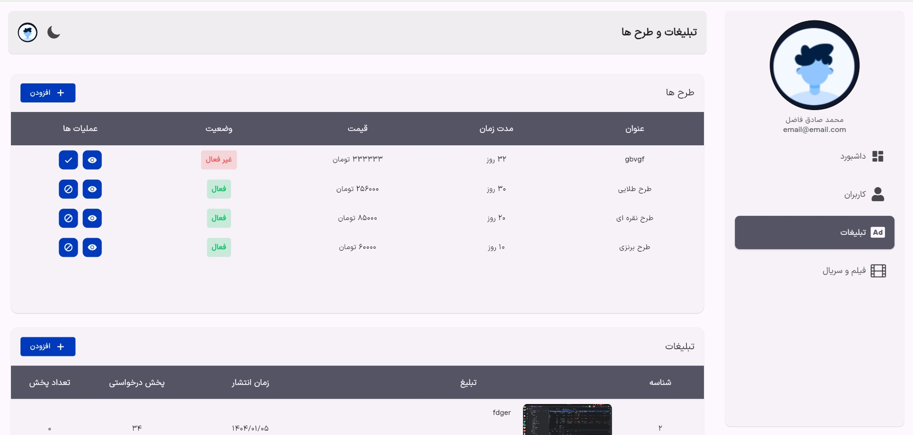
    
    
    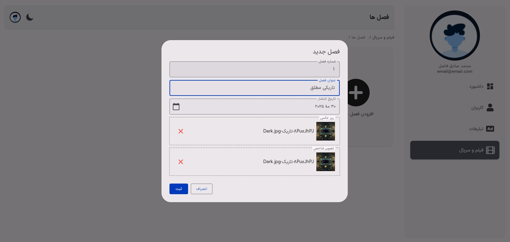
    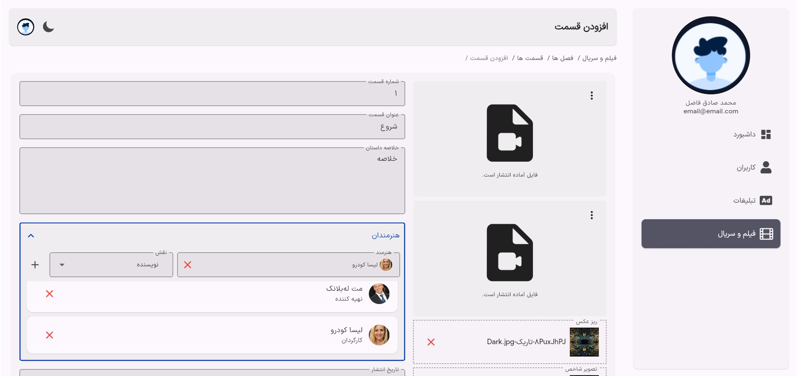
    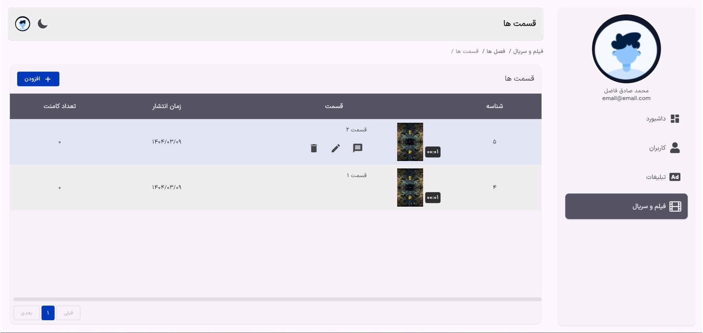
    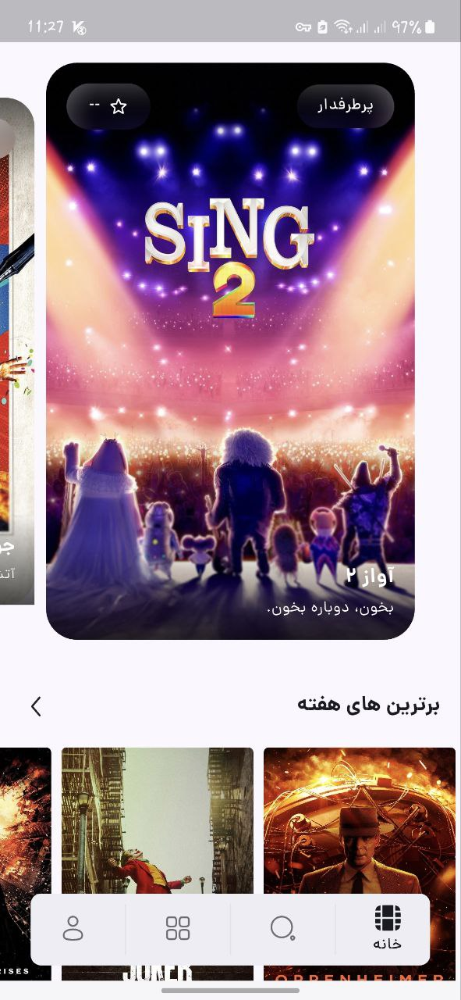
    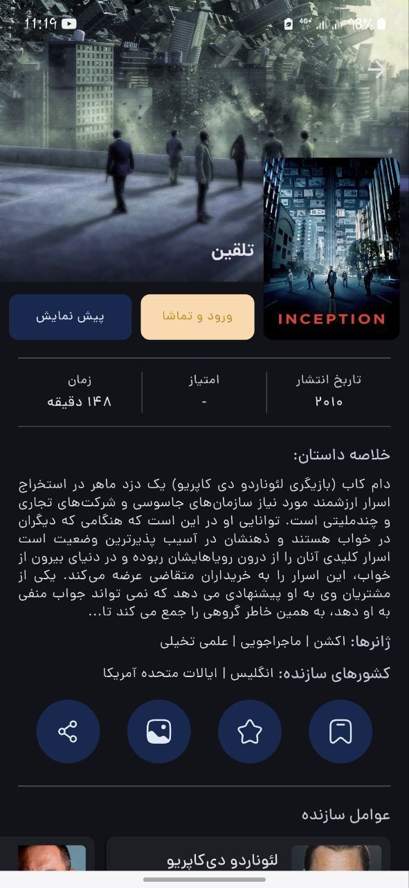
    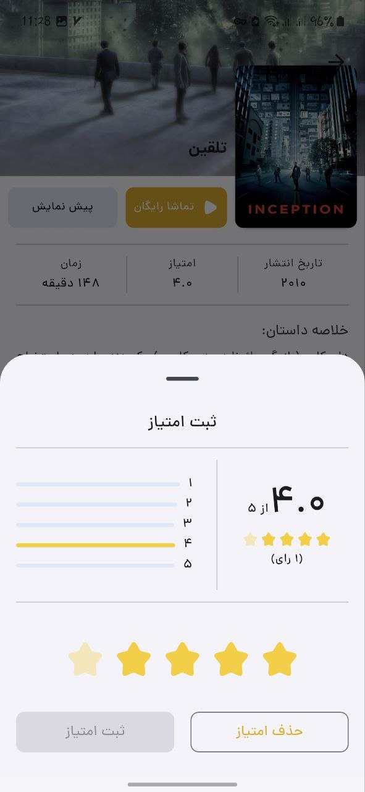
    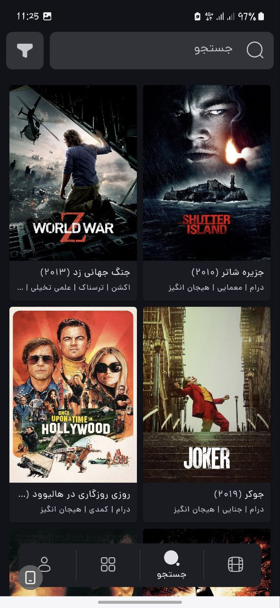
    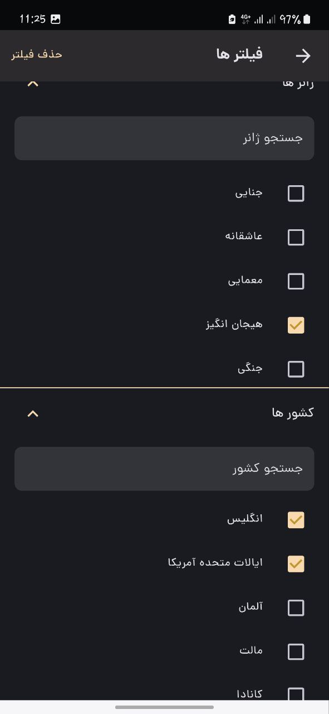
    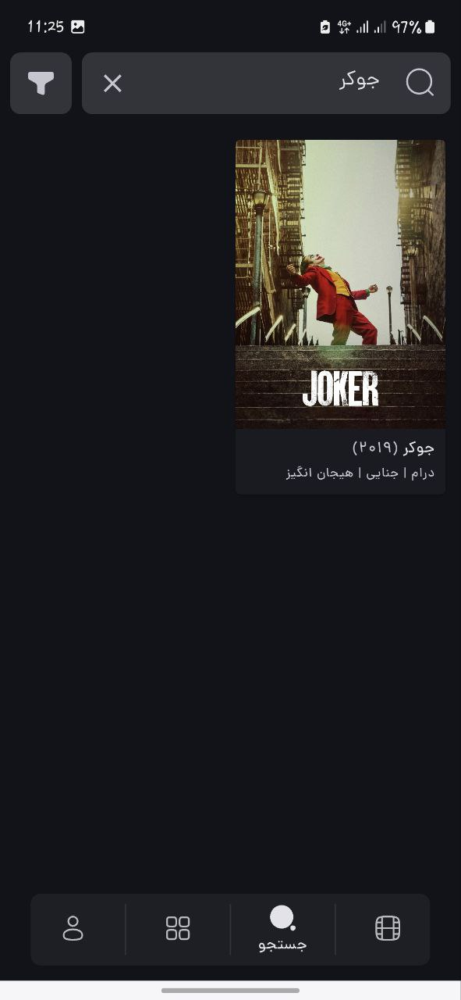
    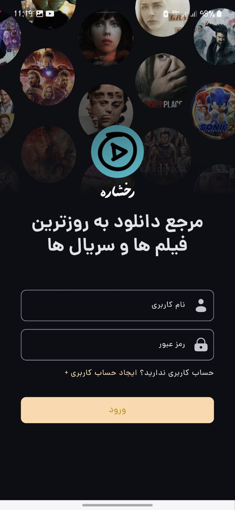
    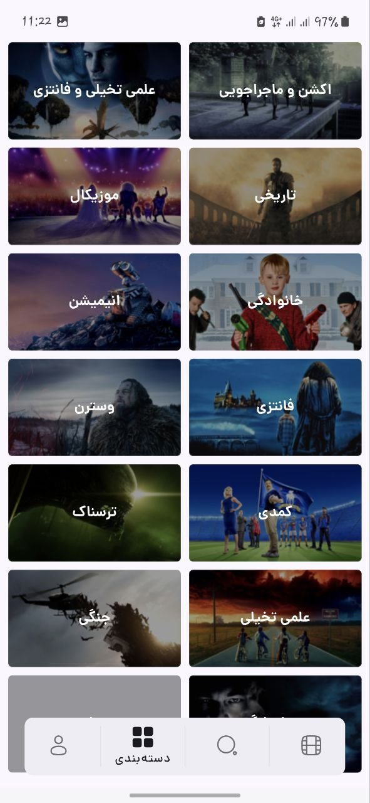
    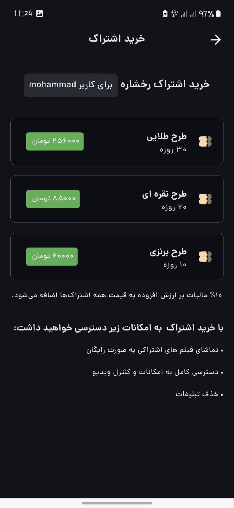
    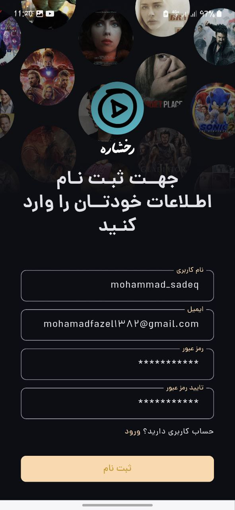

